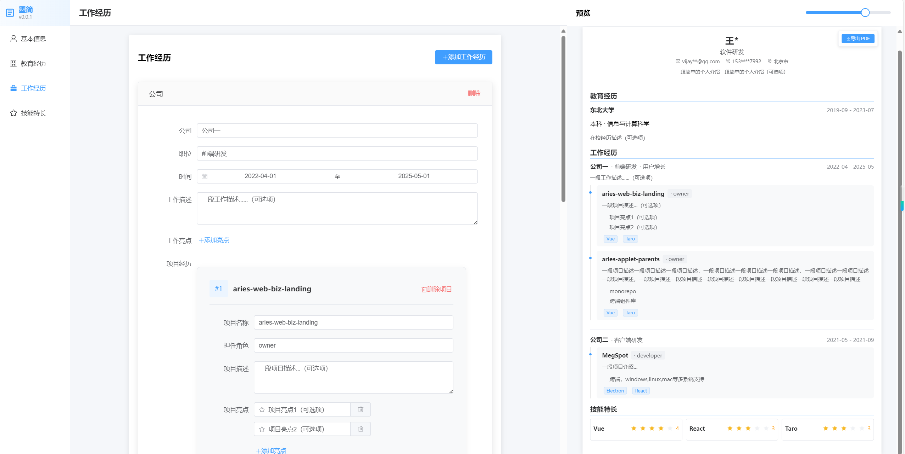

# 简历编辑器

一个在线简历编辑器，基于 Vue 3 + TypeScript + Element Plus 开发。

## 背景

~~在探索市面上的简历编辑器时，我发现了一些不尽如人意的地方：~~

~~- 许多编辑器强制要求填写大量必填字段，限制了用户的自由度~~
~~- 模板设计过于花哨，偏离了简历的本质~~
~~- 内容结构不够灵活，难以突出个人特色~~

~~基于这些痛点，我希望打造一款真正以用户为中心的简历编辑器：~~

~~- 🎯 极简设计：专注于内容本身，去除冗余装饰~~
~~- 🔓 完全自由：所有字段均为可选，尊重用户选择~~
~~- 📝 灵活布局：支持自由组织公司/项目经历~~
~~- ✨ 个性展现：让简历成为展现个人特色的画布~~

一时兴起，为满足自己的简历编写需求 🤪

## 功能特点

- 📝 所见即所得的编辑体验
- 🎨 ~~多种简历模板~~ 目前仅提供一种简洁模板（按照自己的偏好设计：简洁，分项目描述，所有字段都为可选项，无非必填字段）
- 💾 自动保存
- 📤 导出 PDF
- 📱 响应式设计

## 预览




## 技术栈

- Vue 3
- TypeScript
- Pinia
- Vue Router
- Element Plus
- UnoCSS
- Vite

## 开发

```bash
# 安装依赖
npm install

# 启动开发服务器
npm run dev

# 构建生产版本
npm run build

# 预览生产构建
npm run preview
```

## 项目结构

```
src/
├── assets/        # 静态资源
├── components/    # 组件
│   ├── editor/    # 编辑器组件
│   ├── preview/   # 预览组件
│   └── common/    # 通用组件
├── composables/   # 组合式函数
├── stores/        # Pinia 状态管理
├── types/         # TypeScript 类型定义
├── utils/         # 工具函数
└── views/         # 页面视图
```

## 许可证

MIT 